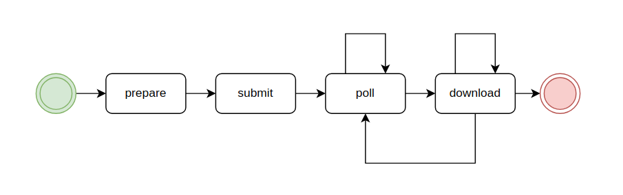

# Setup

Connect to the canonical VPN

    sudo apt install python3-apt
    sudo snap install astral-uv
    sudo snap install canonical-secscan-client
    sudo snap connect canonical-secscan-client:home snapd

    chmod +x sbomber
    cd examples/base

    # put sbomber in your PATH, or run it as:
    ../../sbomber 

If you want to download remote:
- charms: you need `juju` on your local environment
- snaps: you need `snap`
- rocks: you need `skopeo` and `tar`.

# Using SBOMber

The main use case of sbomber is a centralized CI runner that periodically runs security-related routine tasks 
on a bunch of charms, snaps, rocks... We call all of those 'artifacts' for short.

The focus here is on parallelism, as many teams have tens of artifacts they need to verify and doing that 
manually or sequentially will take time.

Therefore, the tool splits the workflow into steps and keeps them in sync using a filesystem-based state file:
- `prepare`: collect all artifacts into a single place
- `submit`: upload each artifact and obtain a unique identifier, or token, for it
- `poll`: query the report generation status for each artifact
- `download`: download all reports (if they are ready)



This is what we call the `parallel` workflow.

## Prepare a manifest

Write to `./sbom_manifest.yaml` a specification of the packages for which you want to request security reports.

```yaml
clients: 
  sbom: 
    department: charm_engineering
    email: luca.bello@canonical.com  # revenge is a dish best served cold
    team: observability
  secscan: {}
  
artifacts:
  - name: parca-k8s
    version: 299
    type: charm

  - name: jhack
    type: snap

  - name: parca-k8s
    type: charm
    source: /home/pietro/canonical/parca-k8s-operator/parca-k8s_ubuntu@24.04-amd64.charm
```

If the 'version' is not provided, sbomber will attempt to detect it based on the artifact:
- `charm`, `snap`, `dist`, and `wheel` by extracting the version from the filename
- `deb` by querying the `apt` tool
- `rock` cannot be detected, so must be provided in the manifest

### Configuring the clients

Want to only request sboms? Omit `secscan` from the clients.
Want to skip sboms? Only include `secscan`.

Want to override on a per-artifact basis what client(s) they will use?

```yaml
clients: 
  sbom: 
    department: charm_engineering
    email: luca.bello@canonical.com  # revenge is a dish best served cold
    team: observability
  secscan: {}
  
  
artifacts:
  - name: parca-k8s
    version: 299
    type: charm
    clients: ['sbom']  # only sbom; no secscan

  - name: jhack
    type: snap
    clients: ['secscan']  # only secscan; no sbom

  - name: parka-k8s
    type: charm
    source: /home/pietro/canonical/parca-k8s-operator/parca-k8s_ubuntu@24.04-amd64.charm
    # default: use all clients
```

Want to have the secscan results automatically transferred to a long-term SSDLC scan registry?

```yaml
clients:
  sbom:
    department: charm_engineering
    email: pietro.pasotti@canonical.com  # a problem shared is a problem halved
    team: observability

artifacts:
  - name: jhack
    type: snap
    base: questing
    version: '461'  # the snap revision
    channel: 'latest/stable'
    ssdlc_params:
      name: jhack  # this is the name to report under, it may differ from the artifact
      version: '461'  # typically the same as the artifact version, set to "" to auto-detect
      channel: 'stable'  # note that this is only the risk component
      cycle: '25.04'
```

For more information on the identification parameters, see
[SEC0025](https://library.canonical.com/corporate-policies/information-security-policies/ssdlc/ssdlc---vulnerability-identification).

## Fetch all packages and prepare the artifacts

> sbomber prepare

This will download the remote artifacts and copy the local ones to `./pkgs`, preparing them for upload.
The state will be saved in `./.statefile.yaml`.


## Submit the artifacts

> sbomber submit

This will upload the artifacts to the respective clients and verify the upload.

## Poll for status

This will update the statefile with the status for each artifact, as reported by the service. 
> sbomber poll

Alternatively, you can block and wait for all artifacts to be ready:

> sbomber poll --wait --timeout 30  

NB: The timeout is in minutes, and applies to each artifact.

You can use the error code to parse the status in the automated way.
The command will return:
 - 0 in case all the requests were successful
 - 1 in case there were failures either in the scan or in the tool
 - 42 in case there's still some requests pending.

## Download all SBOMs and scan results

> sbomber download
 
This will download all ready artifacts to `./reports`


## Additional configuration options

Check the CLI help for more parameters and options.


# Using the end to end sequential workflow

There is also an "end to end" workflow exposed by the `sbomber sequential [sbom|secscan] /path/to/artifact` commands, 
which will fetch and upload the artifact, wait for the report to be ready and download it in a 
blocking fashion, rendering the statefile unnecessary.

This is handy to integrate in individual artifact-generating CIs, e.g. to run the tool every time a new version is released.
